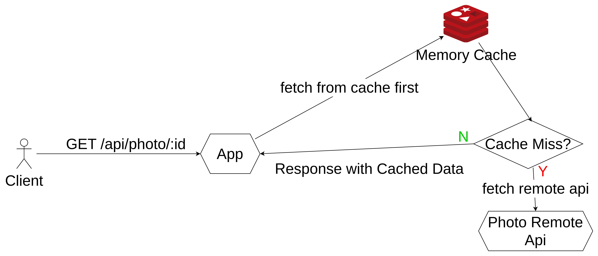
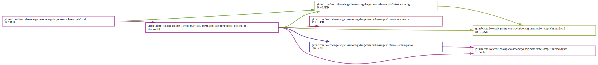
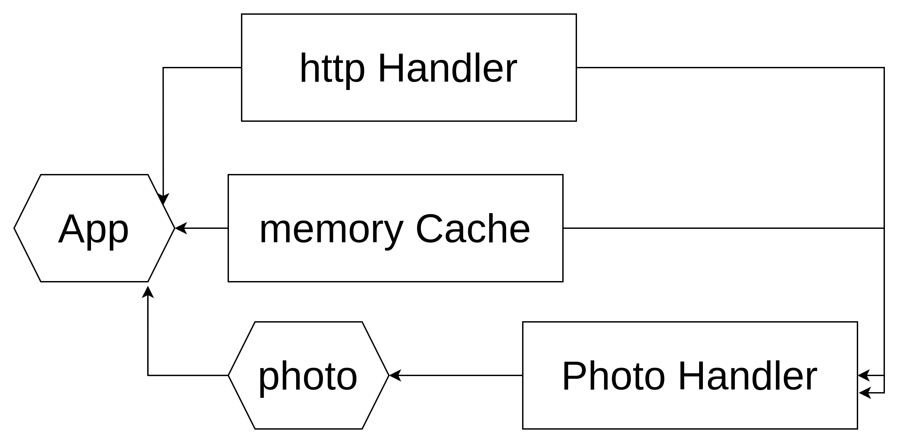

# golang-memcache-sample

This project is to demo how to use memcache to lower latency while data are existed with golang

## architecture



## package dependency

1. fiber
```shell
go get github.com/gofiber/fiber/v2
```
2. memcache
```shell
go get github.com/bradfitz/gomemcache/memcache
```

## dependency diagram

```shell=
goda graph github.com/leetcode-golang-classroom/golang-memcache-sample/... | dot -Tsvg -o dependency-graph.svg
```



## injection relation



## docker compose run

```shell
docker compose up -d
```